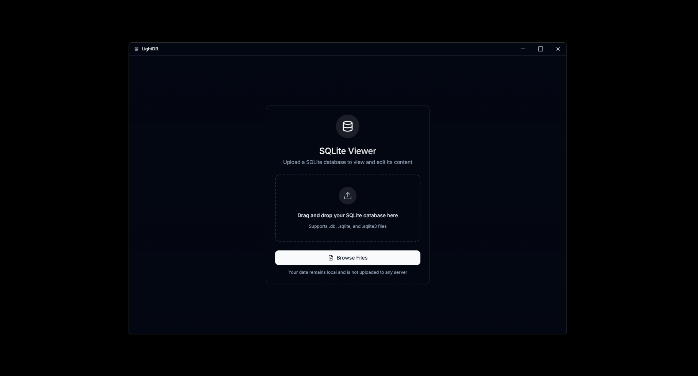

# LightDB

A modern, fast, and user-friendly SQLite database viewer/editor built with React and Electron. View, edit, and manage your SQLite databases with a beautiful interface.



## Features

- 🚀 **Fast and Responsive**: Built with performance in mind
- 🎨 **Modern UI**: Clean interface using Tailwind CSS
- 📝 **Edit Support**: View and edit database records directly
- 🔍 **Advanced Search**: Filter and search through your data
- ⚡ **Real-time Updates**: Changes reflect immediately
- 💾 **Save Changes**: Save modifications back to the original database file
- 📊 **Data Sorting**: Sort any column with a click
- 📱 **Responsive Design**: Works great on any screen size
- 🔄 **Batch Operations**: Execute multiple SQL statements with transaction support
- 📜 **SQL Script Management**: Save and reuse your SQL scripts

## Tech Stack

- ⚛️ React
- 🔷 TypeScript
- ⚡ Vite
- 🎨 Tailwind CSS
- 🖥️ Electron

## Getting Started

### Prerequisites

- Node.js (v16 or higher)
- npm or yarn

### Installation

1. Clone the repository:
```bash
git clone https://github.com/yourusername/sleek-database-viewer.git
cd sleek-database-viewer
```

2. Install dependencies:
```bash
npm install
# or
yarn install
```

3. Start the development server:
```bash
npm run dev
# or
yarn dev
```

### Building for Production

```bash
npm run build
# or
yarn build
```

## Usage

### Basic Database Operations

1. Launch the application
2. Click "Upload Database" or drag and drop your SQLite database file
3. Browse tables using the table selector
4. Use the search bar to filter data
5. Double-click any row to edit
6. Click "Save Changes" to persist modifications

### Batch Operations & SQL Scripting

The batch operations feature allows you to execute multiple SQL statements at once, which is perfect for complex database operations.

#### Using Batch Operations

1. After loading a database, click on the "Batch Operations" tab
2. Enter your SQL statements in the editor, separating them with semicolons (`;`)
3. Use the "Use Transaction" toggle to enable/disable transaction mode:
   - When enabled (default): All statements succeed or none do (atomic operations)
   - When disabled: Each statement is executed independently
4. Click "Execute Script" to run your SQL commands
5. View the results including execution time, affected tables, and any errors

#### Saving and Reusing Scripts

1. Write your SQL script in the editor
2. Enter a name for your script in the input field
3. Click "Save Script" to store it for future use
4. Access your saved scripts by clicking on the "Saved Scripts" tab
5. Use the "Load" button to load a script back into the editor
6. Delete unwanted scripts with the delete button

#### Example Scripts

Here are some example SQL scripts you can try:

**Create new table and insert data:**
```sql
CREATE TABLE users (
  id INTEGER PRIMARY KEY,
  name TEXT NOT NULL,
  email TEXT,
  age INTEGER
);

INSERT INTO users (id, name, email, age) VALUES (1, 'name-example1', 'name1@example.com', 32);
INSERT INTO users (id, name, email, age) VALUES (2, 'name-example2', 'name2@example.com', 28);
```

**Update and delete records:**
```sql
UPDATE users SET age = 33 WHERE name = 'John Doe';
DELETE FROM users WHERE name = 'Jane Smith';
```

**Schema modifications:**
```sql
ALTER TABLE users ADD COLUMN created_at TEXT;
UPDATE users SET created_at = datetime('now');
CREATE INDEX idx_users_name ON users (name);
```

**Complex operations with transaction:**
```sql
BEGIN TRANSACTION;
CREATE TABLE temp_users AS SELECT * FROM users;
UPDATE users SET age = age + 1;
INSERT INTO users SELECT * FROM temp_users WHERE age > 30;
DROP TABLE temp_users;
COMMIT;
```

## Development

### Project Structure

```
src/
  ├── components/     # React components
  ├── hooks/         # Custom React hooks
  ├── lib/           # Utilities and services
  ├── styles/        # Global styles
  └── types/         # TypeScript type definitions
```

### Contributing

1. Fork the repository
2. Create your feature branch (`git checkout -b feature/amazing-feature`)
3. Commit your changes (`git commit -m 'Add some amazing feature'`)
4. Push to the branch (`git push origin feature/amazing-feature`)
5. Open a Pull Request

## License

This project is licensed under the MIT License - see the [LICENSE](LICENSE) file for details.
